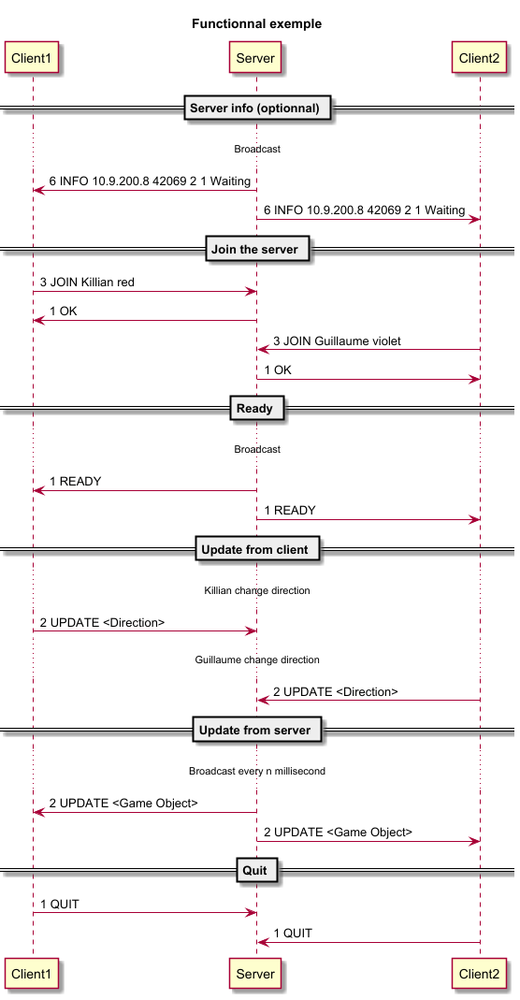

# The Tronocol Protocol

For the purpose of our studies, we need to create a protocol that will allow us to communicate over the network to implement our second laboratory.

## Section 1 - Overview

The Tronocol protocol is a communication protocol that allows the communication between a server and a client
to play the game Tron.

## Section 2 - Transport protocol

As for the transport protocol used, it uses UDP (User Datagram Protocol) in unicast and broadcast mode 
to ensure performance in communicating the data from the clients to the server and vice versa. 
It uses the port `42069`.

Since the information is stored and transmitted as binary data, it does not use any encoding.

Considering the maximum size of a UDP package, the application will send data one package at a time containing
all the data required. 

The messages and actions will be treated binary so simplify data transfer between the client and the server.

The client is the one initiating and closing his communication between him and the server. 

If an unexpected action occurs, the server will simply ignore the message and send an error to
the client that sent the action.

(Optional) The server broadcasts over the Tronocol Protocol that it provides its service.
(Optional) A client can hear the broadcast and lists all the server present on the same network.

Upon choosing the desired server, the client send its player over the network with is choose color and username.

The server checks if the username and the color are both available. In case it's not, it returns an error and 
the client must submit it again.

Upon having the specified number of player at the start of the server, the server waits 5 second and then broadcasts
over the network to start the game to everyone.

Each update the client sends the player to the server over the network and receives the world computed in return.
    
## Section 3 - Messages

### Join the server

The client sends a message to the server with its username and color.

#### Request

```Tronocol
JOIN <username> <color>
```
- `username`: the user's name.
- `color`: the user's color.

#### Response

- `OK`: both the username and the color are available and the user is registered.
- `ERROR <code>`: The username or the color is not available.
    - `1` : The username is already used.
    - `2` : The color is already used.
    - `3` : The session is full.
      
### Ready

The server sends a broadcast message to all the client to start the games

#### Request

```Tronocol
READY
```

#### Response
None.

### Update from client

The client sends its player data to the server.

#### Request

```Tronocol
UPDATE <player_data>
```

- `player_data`: the player object as binary data.

#### Response`

None.

### Update from server

The server sends the world to all clients.

#### Request

```Tronocol
UPDATE  <world_data>
```

- `world_data`: the data of the world as binary data.

#### Response

None.

### Quit

The client leaves from the server.

#### Request

```Tronocol
QUIT <username>
```
- `username` : the user's name.

#### Response

None.

(Optional)

### Server info

The server broadcast its information so every client can see the available servers.

#### Request

```Tronocol
INFO <ip> <port> <number_of_player> <description> <status>
```

- `ip` : the server's ip.
- `port` : the serve's port.
- `number_of_player` : the number of player that join the session
- `description` : the description of the server
- `status` : the game status

#### Response

None.

## Section 4 - Examples

### Functional example



### Join errors

